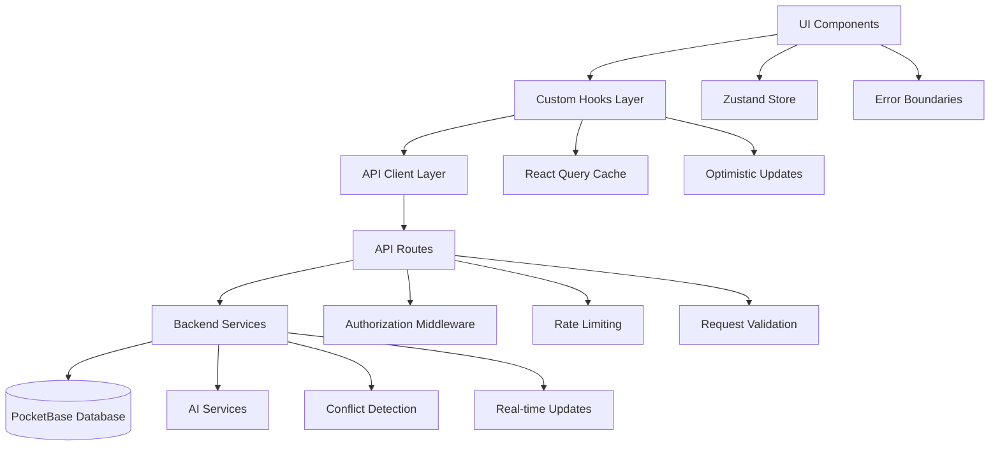

# Design Document

## Overview

This design document outlines the architecture and implementation strategy for completing the component infrastructure, standardizing data flow, fixing type definitions, and implementing comprehensive integration testing. The design focuses on high performance, maintainability, and developer experience while leveraging the existing robust API infrastructure.

## Architecture

### High-Level Architecture



### Component Architecture Pattern

```typescript
// Standardized Component Pattern
interface ComponentProps {
  // Strictly typed props
}

const Component: React.FC<ComponentProps> = React.memo((props) => {
  // 1. Custom hooks for data fetching
  const { data, loading, error, refetch } = useCustomHook();
  
  // 2. Local state management
  const [localState, setLocalState] = useState();
  
  // 3. Global state integration
  const { globalState, updateGlobalState } = useApplicationStore();
  
  // 4. Event handlers with optimistic updates
  const handleAction = useOptimisticMutation({
    mutationFn: apiCall,
    onOptimisticUpdate: optimisticUpdate,
    onSuccess: successHandler,
    onError: errorHandler
  });
  
  // 5. Loading and error states
  if (loading) return <LoadingSkeleton />;
  if (error) return <ErrorState error={error} onRetry={refetch} />;
  
  // 6. Main render with memoized expensive operations
  return useMemo(() => (
    <div>
      {/* Component JSX */}
    </div>
  ), [data, localState]);
});
```

## Components and Interfaces

### 1. Journal System Components

#### JournalEntry Component
```typescript
interface JournalEntryProps {
  entry: JournalEntry;
  onEdit: (entry: JournalEntry) => void;
  onDelete: (id: string) => void;
  onShare?: (entry: JournalEntry) => void;
  compact?: boolean;
}

interface JournalEntry {
  id: string;
  userId: string;
  title: string;
  content: string;
  mood: MoodType;
  tags: string[];
  isPrivate: boolean;
  createdAt: string;
  updatedAt: string;
  attachments?: Attachment[];
  analytics?: EntryAnalytics;
}
```

#### JournalEntryForm Component
```typescript
interface JournalEntryFormProps {
  entry?: JournalEntry;
  onSave: (entry: Omit<JournalEntry, 'id' | 'createdAt' | 'updatedAt'>) => Promise<void>;
  onCancel: () => void;
  autoSave?: boolean;
}
```

### 2. Creative Assistant Components

#### CreativeAssistant Component
```typescript
interface CreativeAssistantProps {
  userId: string;
  projectId?: string;
  initialPrompt?: string;
  onSessionCreate: (session: CreativeSession) => void;
}

interface CreativeSession {
  id: string;
  userId: string;
  projectId?: string;
  type: 'brainstorm' | 'feedback' | 'outline' | 'generate';
  input: string;
  output: string;
  metadata: SessionMetadata;
  createdAt: string;
}
```

### 3. Wellness Components

#### MoodFocusCheckIn Component
```typescript
interface MoodFocusCheckInProps {
  userId: string;
  onCheckInComplete: (checkIn: MoodFocusEntry) => void;
  showTrends?: boolean;
  compact?: boolean;
}

interface MoodFocusEntry {
  id: string;
  userId: string;
  mood: MoodLevel;
  focus: FocusLevel;
  energy: EnergyLevel;
  stress: StressLevel;
  notes?: string;
  tags?: string[];
  createdAt: string;
}
```

## Data Models

### Unified Type System

```typescript
// Core Types
export type MoodLevel = 'very-low' | 'low' | 'medium' | 'high' | 'very-high';
export type FocusLevel = 'very-low' | 'low' | 'medium' | 'high' | 'very-high';
export type EnergyLevel = 'very-low' | 'low' | 'medium' | 'high' | 'very-high';
export type StressLevel = 'very-low' | 'low' | 'medium' | 'high' | 'very-high';

// API Response Types
export interface ApiResponse<T> {
  success: boolean;
  data?: T;
  error?: string;
  message?: string;
  pagination?: PaginationInfo;
}

export interface PaginationInfo {
  page: number;
  limit: number;
  total: number;
  hasMore: boolean;
}

// Database Entity Base
export interface BaseEntity {
  id: string;
  createdAt: string;
  updatedAt: string;
}
```

### Custom Hooks Architecture

```typescript
// Generic Data Fetching Hook
export function useApiData<T>(
  endpoint: string,
  options?: {
    enabled?: boolean;
    refetchInterval?: number;
    cacheTime?: number;
  }
): {
  data: T | null;
  loading: boolean;
  error: Error | null;
  refetch: () => Promise<void>;
  mutate: (data: T) => void;
}

// Optimistic Mutation Hook
export function useOptimisticMutation<TData, TVariables>({
  mutationFn,
  onOptimisticUpdate,
  onSuccess,
  onError,
  onRollback
}: OptimisticMutationConfig<TData, TVariables>): {
  mutate: (variables: TVariables) => Promise<TData>;
  loading: boolean;
  error: Error | null;
  rollback: () => void;
}
```

## Error Handling

### Error Boundary System

```typescript
// Hierarchical Error Boundaries
<CriticalErrorBoundary>
  <AsyncErrorBoundary>
    <PageErrorBoundary>
      <ComponentErrorBoundary>
        <Component />
      </ComponentErrorBoundary>
    </PageErrorBoundary>
  </AsyncErrorBoundary>
</CriticalErrorBoundary>
```

### Error Types and Handling

```typescript
export class ApiError extends Error {
  constructor(
    message: string,
    public status: number,
    public code?: string,
    public details?: unknown
  ) {
    super(message);
    this.name = 'ApiError';
  }
}

export class ValidationError extends Error {
  constructor(
    message: string,
    public field: string,
    public value: unknown
  ) {
    super(message);
    this.name = 'ValidationError';
  }
}

export class ConflictError extends Error {
  constructor(
    message: string,
    public conflictData: ConflictData
  ) {
    super(message);
    this.name = 'ConflictError';
  }
}
```

## Testing Strategy

### Integration Testing Architecture

```typescript
// Test Environment Setup
export class TestEnvironment {
  private testDb: TestDatabase;
  private testServer: TestServer;
  
  async setup() {
    // Initialize test database
    this.testDb = new TestDatabase();
    await this.testDb.initialize();
    
    // Start test server
    this.testServer = new TestServer();
    await this.testServer.start();
    
    // Seed test data
    await this.seedTestData();
  }
  
  async cleanup() {
    await this.testDb.cleanup();
    await this.testServer.stop();
  }
}

// Real API Testing Pattern
describe('Journal API Integration', () => {
  let testEnv: TestEnvironment;
  
  beforeAll(async () => {
    testEnv = new TestEnvironment();
    await testEnv.setup();
  });
  
  afterAll(async () => {
    await testEnv.cleanup();
  });
  
  it('should create, read, update, and delete journal entries', async () => {
    // Test actual API endpoints
    const createResponse = await fetch('/api/journal/entries', {
      method: 'POST',
      body: JSON.stringify(testEntryData)
    });
    
    expect(createResponse.ok).toBe(true);
    const createdEntry = await createResponse.json();
    
    // Continue with real API calls...
  });
});
```

### Component Testing Strategy

```typescript
// Component Integration Testing
export function renderWithProviders(
  ui: React.ReactElement,
  options?: {
    initialState?: Partial<ApplicationState>;
    user?: TestUser;
  }
) {
  const AllProviders = ({ children }: { children: React.ReactNode }) => (
    <TestQueryProvider>
      <TestAuthProvider user={options?.user}>
        <TestStoreProvider initialState={options?.initialState}>
          <TestToastProvider>
            {children}
          </TestToastProvider>
        </TestStoreProvider>
      </TestAuthProvider>
    </TestQueryProvider>
  );
  
  return render(ui, { wrapper: AllProviders, ...options });
}
```

## Performance Optimizations

### Code Splitting Strategy

```typescript
// Route-based code splitting
const JournalPage = lazy(() => import('../pages/JournalPage'));
const CreativeAssistantPage = lazy(() => import('../pages/CreativeAssistantPage'));
const WellnessPage = lazy(() => import('../pages/WellnessPage'));

// Component-based code splitting
const HeavyComponent = lazy(() => import('../components/HeavyComponent'));

// Hook-based code splitting for large utilities
const useAdvancedAnalytics = lazy(() => import('../hooks/useAdvancedAnalytics'));
```

### Caching Strategy

```typescript
// API Response Caching
export const cacheConfig = {
  journal: {
    staleTime: 5 * 60 * 1000, // 5 minutes
    cacheTime: 30 * 60 * 1000, // 30 minutes
  },
  analytics: {
    staleTime: 15 * 60 * 1000, // 15 minutes
    cacheTime: 60 * 60 * 1000, // 1 hour
  },
  userProfile: {
    staleTime: 60 * 60 * 1000, // 1 hour
    cacheTime: 24 * 60 * 60 * 1000, // 24 hours
  }
};

// Optimistic Updates with Rollback
export function useOptimisticJournalEntry() {
  return useOptimisticMutation({
    mutationFn: updateJournalEntry,
    onOptimisticUpdate: (variables) => {
      // Immediately update UI
      queryClient.setQueryData(['journal', variables.id], variables);
    },
    onError: (error, variables, context) => {
      // Rollback on error
      queryClient.setQueryData(['journal', variables.id], context.previousData);
    }
  });
}
```

### Bundle Optimization

```typescript
// next.config.ts optimizations
export default {
  experimental: {
    optimizePackageImports: [
      'lucide-react',
      'recharts',
      '@google/generative-ai'
    ],
  },
  webpack: (config) => {
    // Tree shaking optimization
    config.optimization.usedExports = true;
    
    // Bundle analyzer in development
    if (process.env.ANALYZE === 'true') {
      config.plugins.push(new BundleAnalyzerPlugin());
    }
    
    return config;
  }
};
```

## Security Considerations

### Input Validation and Sanitization

```typescript
// Zod schemas for validation
export const JournalEntrySchema = z.object({
  title: z.string().min(1).max(200),
  content: z.string().min(1).max(10000),
  mood: z.enum(['very-low', 'low', 'medium', 'high', 'very-high']),
  tags: z.array(z.string()).max(10),
  isPrivate: z.boolean()
});

// Sanitization utility
export function sanitizeHtml(content: string): string {
  return DOMPurify.sanitize(content, {
    ALLOWED_TAGS: ['p', 'br', 'strong', 'em', 'u'],
    ALLOWED_ATTR: []
  });
}
```

### Authentication and Authorization

```typescript
// Enhanced auth middleware
export function withAuth<T extends NextRequest>(
  handler: (req: T, user: AuthenticatedUser) => Promise<NextResponse>,
  options?: {
    requiredPermissions?: Permission[];
    allowedRoles?: UserRole[];
  }
) {
  return async (req: T): Promise<NextResponse> => {
    const authResult = await authenticate(req);
    
    if (!authResult.success) {
      return NextResponse.json(
        { error: 'Authentication required' },
        { status: 401 }
      );
    }
    
    if (options?.requiredPermissions) {
      const hasPermission = checkPermissions(
        authResult.user,
        options.requiredPermissions
      );
      
      if (!hasPermission) {
        return NextResponse.json(
          { error: 'Insufficient permissions' },
          { status: 403 }
        );
      }
    }
    
    return handler(req, authResult.user);
  };
}
```

## Deployment and Monitoring

### Health Checks and Monitoring

```typescript
// Health check endpoint
export async function GET() {
  const checks = await Promise.allSettled([
    checkDatabase(),
    checkAIService(),
    checkExternalAPIs()
  ]);
  
  const health = {
    status: checks.every(check => check.status === 'fulfilled') ? 'healthy' : 'degraded',
    timestamp: new Date().toISOString(),
    services: {
      database: checks[0].status === 'fulfilled' ? 'up' : 'down',
      ai: checks[1].status === 'fulfilled' ? 'up' : 'down',
      external: checks[2].status === 'fulfilled' ? 'up' : 'down'
    }
  };
  
  return NextResponse.json(health);
}
```

This design provides a comprehensive foundation for implementing high-performance, maintainable components with robust testing and excellent developer experience.